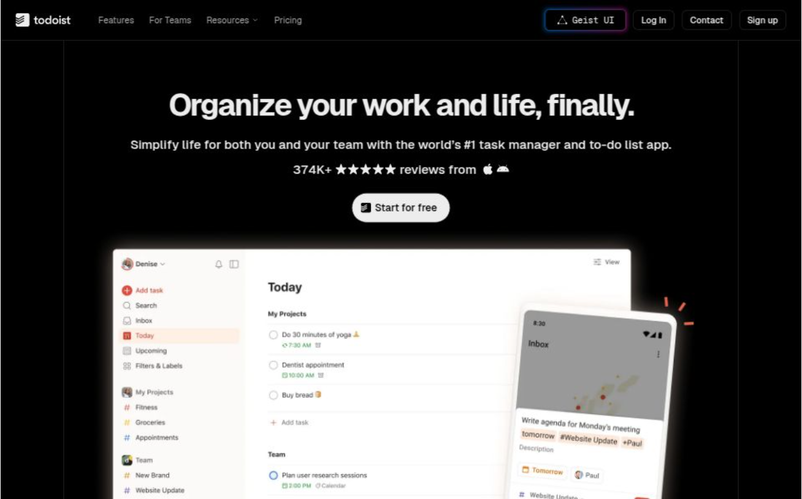

This is a [Next.js](https://nextjs.org/) (v15 based) project inspired by [Todoist](https://todoist.com) and [Vercel](https://vercel.com).

# Todoist NEXT

## ⚠️ _Some functionalities and pages are not done yet._

In this project, I put my all my knowledge about **Next.js** and **React**. The styling is being built with [TailwindCSS](https://tailwindcss.com/) The purpose is to learn to build fast, add full of functionalities, handling API requests, using next's middleware, build attractive UI, build reusable UI components inspired by Radix and Shadcn, and so on. The UI components are demonstrated at [/geist/introduction](https://todoist-liard-alpha.vercel.app/geist/introduction) page. The only 3rd party libraries I use here are `framer-motion`(handles open and close animations) and `react-lock-focus` (handles focus events for accessibility).   
You might see some issues with the responsive design, because I'm currently focues on the UI components. The authentication part is done, and you can look into the server side on my [todoist-server](https://github.com/ZeynalliZeynal/todoist-server) repo. The auth links goes under the route `/auth`.
